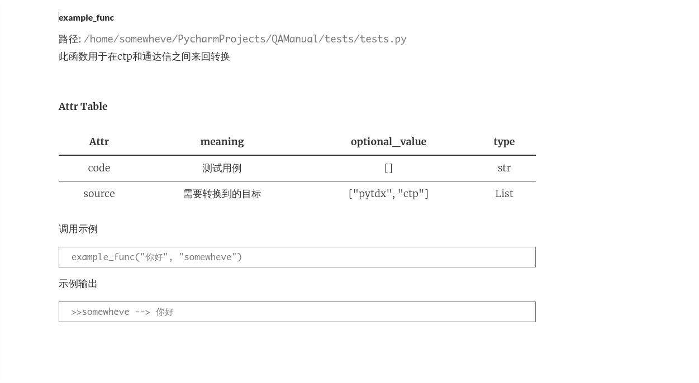

# QAManual
Python Manual Auto Generate Program,

Note that you need to add in the specified format

> Hate writing documents 

### Two purposes

- Generate manual documents
- Command quick search

### Install
```text
pip install QAManual
```

### How to use 

1. cd to the root path of your project 
2. execute the following command
```text
qaman -init .
```

### Developer Usage
Of course you should write `__doc__` as a specific way as the following code

```python
from QAManual import FunctionParser
from QAManual import MarkdownWriter


def example_func(code, source):
    """
    QAMAN
    explanation:
        此函数用于在ctp和通达信之间来回转换

    params:
        * code ->
            含义: 测试用例
            类型: str
            参数支持: []
        * source ->
            含义: 需要转换到的目标
            类型: List
            参数支持: ["pytdx", "ctp"]

    demonstrate:
        example_func("你好", "somewheve")

    output:
        >>somewheve --> 你好

    """
    print(source, "-->", code)


if __name__ == '__main__':
    parser = FunctionParser(example_func)
    writer = MarkdownWriter(parser.union.__name__, parser.get_node(), language="zh")
    writer.handle()
```

运行截图:
    

### Todo
- According to the specified template
- Build search command ( Can you  teach me algorithm )

###  Finished
- Structured
- Generate documentation 
- Chinese and English support(Only supports a single)


Author: [somewheve](https://github.com/somewheve)